
 <h2 style="color: gray; font-size:35px;"> Bakalářský studijní program Geodézie a kartografie </h2> 

## 4. semestr 

-   
    <a href="https://k155cvut.github.io/gis-1/"> 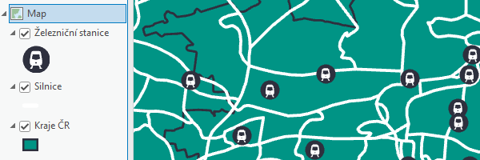{ .off-glb } <a>

    [__GIS 1__](https://k155cvut.github.io/gis-1/){ .md-button .md-button--primary }

    __Garant:__ [Prof. Ing. Lena Halounová, CSc. ](https://geomatics.fsv.cvut.cz/employees/lena-halounova/)

    __Vyučující:__ [Ing. Jaroslav Šedina, PhD.](https://geomatics.fsv.cvut.cz/employees/jaroslav-sedina/), [Ing. Martin Landa, PhD.](https://geomatics.fsv.cvut.cz/employees/martin-landa/), [Ing. František Mužík](https://geomatics.fsv.cvut.cz/employees/frantisek-muzik/)

-    <a href="https://k155cvut.github.io/kar1/"> 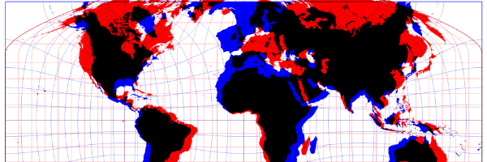{ .off-glb } <a>

    [__Kartografie 1__](){ .md-button .md-button--primary }

    __Garant:__ [Prof. Ing. Jiří Cajthaml, Ph.D.](https://geomatics.fsv.cvut.cz/employees/jiri-cajthaml/)

    __Vyučující:__ [Prof. Ing. Jiří Cajthaml, Ph.D.](https://geomatics.fsv.cvut.cz/employees/jiri-cajthaml/)

## 5. semestr 

-   
    <a href="https://k155cvut.github.io/gis-2/"> 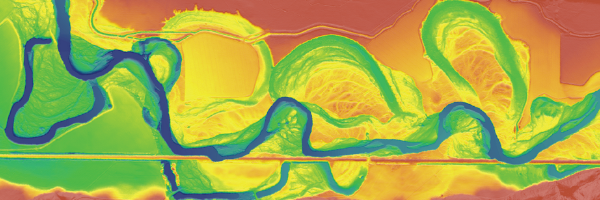{ .off-glb } <a>

    [__GIS 2__](https://k155cvut.github.io/gis-2/){ .md-button .md-button--primary }

    __Garant:__ [Prof. Ing. Lena Halounová, CSc.](https://geomatics.fsv.cvut.cz/employees/lena-halounova/)

    __Vyučující:__ [Ing. Jaroslav Šedina, PhD.](https://geomatics.fsv.cvut.cz/employees/jaroslav-sedina/), [Ing. Martin Landa, PhD.](https://geomatics.fsv.cvut.cz/employees/martin-landa/), [Ing. František Mužík](https://geomatics.fsv.cvut.cz/employees/frantisek-muzik/)

-   <a href="https://k155cvut.github.io/kar2/"> 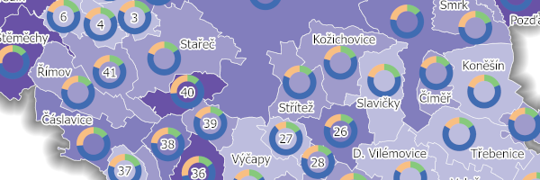{ .off-glb } <a>

    [__Kartografie 2__](https://k155cvut.github.io/kar2/){ .md-button .md-button--primary }

    __Garant:__ [Prof. Ing. Jiří Cajthaml, Ph.D.](https://geomatics.fsv.cvut.cz/employees/jiri-cajthaml/)

    __Vyučující:__ [Ing. Tomáš Janata, Ph.D.](https://geomatics.fsv.cvut.cz/employees/tomas-janata/), [Mgr. Petra Justová, Ph.D.](https://geomatics.fsv.cvut.cz/employees/petra-justova/), [Ing. Josef Münzberger](https://geomatics.fsv.cvut.cz/employees/josef-munzberger/)

 <h2 style="color: gray; font-size:35px;"> Magisterský studijní program Geodézie a kartografie </h2> 

## 1. semestr 

-   
    <a href="https://k155cvut.github.io/kar3/"> 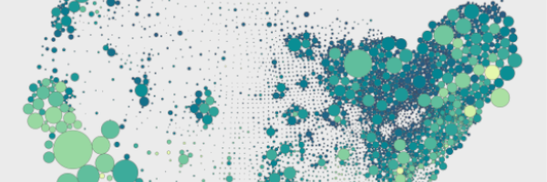{ .off-glb } <a>

    [__Kartografie 3__](https://k155cvut.github.io/kar3/){ .md-button .md-button--primary }

    __Garant:__ [Prof. Ing. Jiří Cajthaml, Ph.D.](https://geomatics.fsv.cvut.cz/employees/jiri-cajthaml/)

    __Vyučující:__ [Ing. Tomáš Janata, Ph.D.](https://geomatics.fsv.cvut.cz/employees/tomas-janata/), [Mgr. Petra Justová, Ph.D.](https://geomatics.fsv.cvut.cz/employees/petra-justova/), [Ing. Josef Münzberger](https://geomatics.fsv.cvut.cz/employees/josef-munzberger/)

-   <a href="https://k155cvut.github.io/dprz/"> 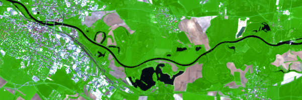{ .off-glb } <a>

    [__Dálkový průzkum Země__](https://k155cvut.github.io/dprz/){ .md-button .md-button--primary }

    __Garant:__ [Prof. Dr. Ing. Karel Pavelka](https://geomatics.fsv.cvut.cz/employees/karel-pavelka/)

    __Vyučující:__ [Ing. Eva Matoušková, Ph.D.](https://geomatics.fsv.cvut.cz/employees/eva-matouskova/), [Ing. Tomáš Bouček](https://geomatics.fsv.cvut.cz/employees/tomas-boucek/)

-   <a href="https://geo.fsv.cvut.cz/vyuka/155uzpr/"> 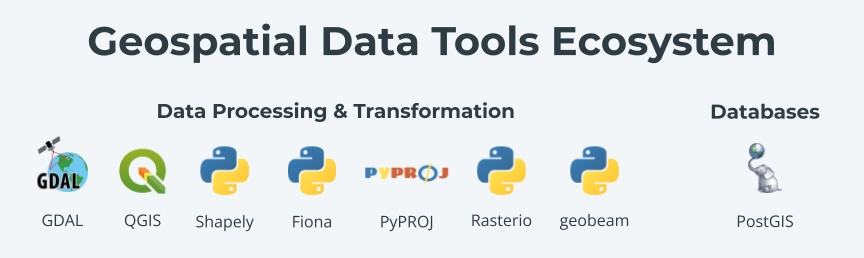{ .off-glb } <a>

    [__Úvod do zpracování prostorových dat__](https://geo.fsv.cvut.cz/vyuka/155uzpr){ .md-button .md-button--primary }

    __Garant:__ [Ing. Martin Landa, PhD.](https://geomatics.fsv.cvut.cz/employees/martin-landa/)

    __Vyučující:__ [Ing. Martin Landa, PhD.](https://geomatics.fsv.cvut.cz/employees/martin-landa/), [Ing. Ondřej Pešek, PhD.](https://geomatics.fsv.cvut.cz/employees/ondrej-pesek/)

-   

## 2. semestr

-   
    <a href="https://k155cvut.github.io/pkar/"> 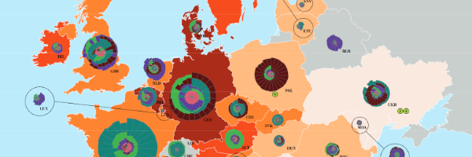{ .off-glb } <a>

    [__Projekt - kartografie__](https://k155cvut.github.io/pkar/){ .md-button .md-button--primary }

    __Garant:__ [Prof. Ing. Jiří Cajthaml, PhD.](https://geomatics.fsv.cvut.cz/employees/jiri-cajthaml/)

    __Vyučující:__ [Ing. Tomáš Janata, Ph.D.](https://geomatics.fsv.cvut.cz/employees/tomas-janata/), [Mgr. Petra Justová, Ph.D.](https://geomatics.fsv.cvut.cz/employees/petra-justova/), [Ing. Josef Münzberger](https://geomatics.fsv.cvut.cz/employees/josef-munzberger/)

-    <a href="https://k155cvut.github.io/weka/"> 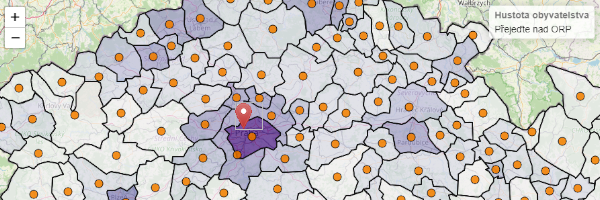{ .off-glb } <a>

    [__Webová kartografie__](https://k155cvut.github.io/weka/){ .md-button .md-button--primary }

    __Garant:__ [Prof. Ing. Jiří Cajthaml, PhD.](https://geomatics.fsv.cvut.cz/employees/jiri-cajthaml/)

    __Vyučující:__ [Ing. Tomáš Janata, PhD.](https://geomatics.fsv.cvut.cz/employees/tomas-janata/), [Ing. František Mužík](https://geomatics.fsv.cvut.cz/employees/frantisek-muzik/)

-   
    <a href="https://geo.fsv.cvut.cz/vyuka/155fgis"> 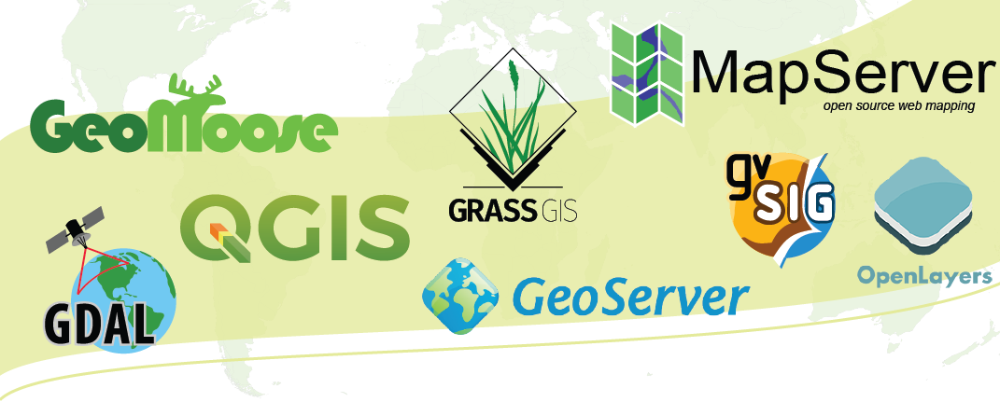{ .off-glb } <a>

    [__Free Software GIS__](https://geo.fsv.cvut.cz/vyuka/155fgis){ .md-button .md-button--primary }

    __Garant:__ [Ing. Martin Landa, PhD.](https://geomatics.fsv.cvut.cz/employees/martin-landa/)

    __Vyučující:__ [Ing. Martin Landa, PhD.](https://geomatics.fsv.cvut.cz/employees/martin-landa/), [Ing. Ondřej Pešek, PhD.](https://geomatics.fsv.cvut.cz/employees/ondrej-pesek/)

-   

## 3. semestr

-   
    <a href="https://geo.fsv.cvut.cz/vyuka/155yusu/index.html"> 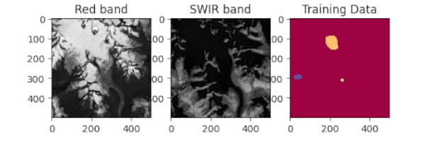{ .off-glb } <a>

    [__Úvod do strojového učení v DPZ__](https://geo.fsv.cvut.cz/vyuka/155yusu/index.html){ .md-button .md-button--primary }

    __Garant:__ [Ing. Martin Landa, PhD.](https://geomatics.fsv.cvut.cz/employees/martin-landa/)

    __Vyučující:__ [Ing. Ondřej Pešek, PhD.](https://geomatics.fsv.cvut.cz/employees/ondrej-pesek/), [Ing. Lukáš Brodský, PhD.](https://is.cuni.cz/webapps/whois2/osoba/1066341682237815/?lang=cs), [Ing. Martin Landa, PhD.](https://geomatics.fsv.cvut.cz/employees/martin-landa/)

-    <a href="https://k155cvut.github.io/yv3d/"> 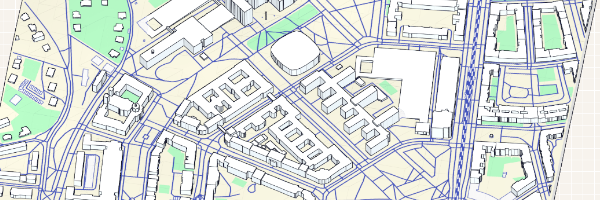{ .off-glb } <a>

    [__Vizualizace 3D modelů pomocí moderních technologií__](https://k155cvut.github.io/yv3d/){ .md-button .md-button--primary }

    __Garant:__ [Prof. Dr. Ing. Karel Pavelka](https://geomatics.fsv.cvut.cz/employees/karel-pavelka/)

    __Vyučující:__ [Ing. Karel Pavelka](https://geomatics.fsv.cvut.cz/employees/karel-pavelka-ml/), [Ing. Michal Janovský, PhD.](https://geomatics.fsv.cvut.cz/employees/michal-janovsky/), [Ing. Vojtěch Cehák](https://geomatics.fsv.cvut.cz/employees/vojtech-cehak/), [Ing. František Mužík](https://geomatics.fsv.cvut.cz/employees/frantisek-muzik/)

 <h2 style="color: gray; font-size:35px;"> List of Erasmus courses </h2> 

-   
    <a href="https://geo.fsv.cvut.cz/courses/155isdp/"> 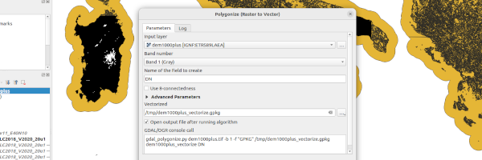{ .off-glb } <a>

    [__Introduction into geospatial data processing__](https://geo.fsv.cvut.cz/courses/155isdp/){ .md-button .md-button--primary }

    __Garant:__ [Ing. Martin Landa, PhD.](https://geomatics.fsv.cvut.cz/employees/martin-landa/)

    __Vyučující:__ [Ing. Martin Landa, PhD.](https://geomatics.fsv.cvut.cz/employees/martin-landa/), [Ing. Ondřej Pešek, PhD.](https://geomatics.fsv.cvut.cz/employees/ondrej-pesek/)

-    <a href="https://k155cvut.github.io/gise/"> 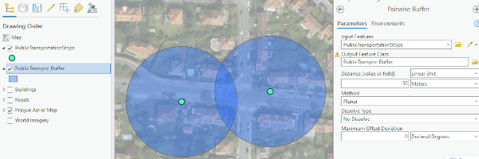{ .off-glb } <a>

    [__Geographic Information Systems__](https://k155cvut.github.io/gise/){ .md-button .md-button--primary }

    __Lectures:__ [Prof. Ing. Jiří Cajthaml, PhD.](https://geomatics.fsv.cvut.cz/employees/jiri-cajthaml/), [Ing. Tomáš Janata, PhD.](https://geomatics.fsv.cvut.cz/employees/tomas-janata/)

    __Practicals:__ [Ing. Josef Münzberger](https://geomatics.fsv.cvut.cz/employees/josef-munzberger/), [Ing. Vojtěch Cehák](https://geomatics.fsv.cvut.cz/employees/vojtech-cehak/)

